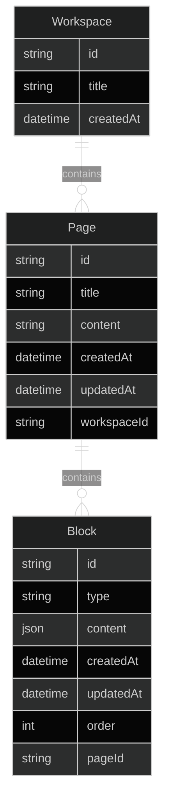

# Database Design Documentation

## Current Schema Structure

### Workspace Model

| Field | Type | Description |
|-------|------|-------------|
| id | String (UUID) | Primary key |
| title | String | Workspace title |
| createdAt | DateTime | Creation timestamp |

### Page Model

| Field | Type | Description |
|-------|------|-------------|
| id | String (UUID) | Primary key |
| title | String | Page title |
| content | String? | Legacy content field |
| createdAt | DateTime | Creation timestamp |
| updatedAt | DateTime | Last update timestamp |
| workspaceId | String | Foreign key to Workspace |

### Block Model

| Field | Type | Description |
|-------|------|-------------|
| id | String (UUID) | Primary key |
| type | String | Block type identifier |
| content | Json? | Block content |
| createdAt | DateTime | Creation timestamp |
| updatedAt | DateTime? | Last update timestamp |
| order | Int | Block sequence |
| pageId | String | Foreign key to Page |

## Entity Relationship Diagram

